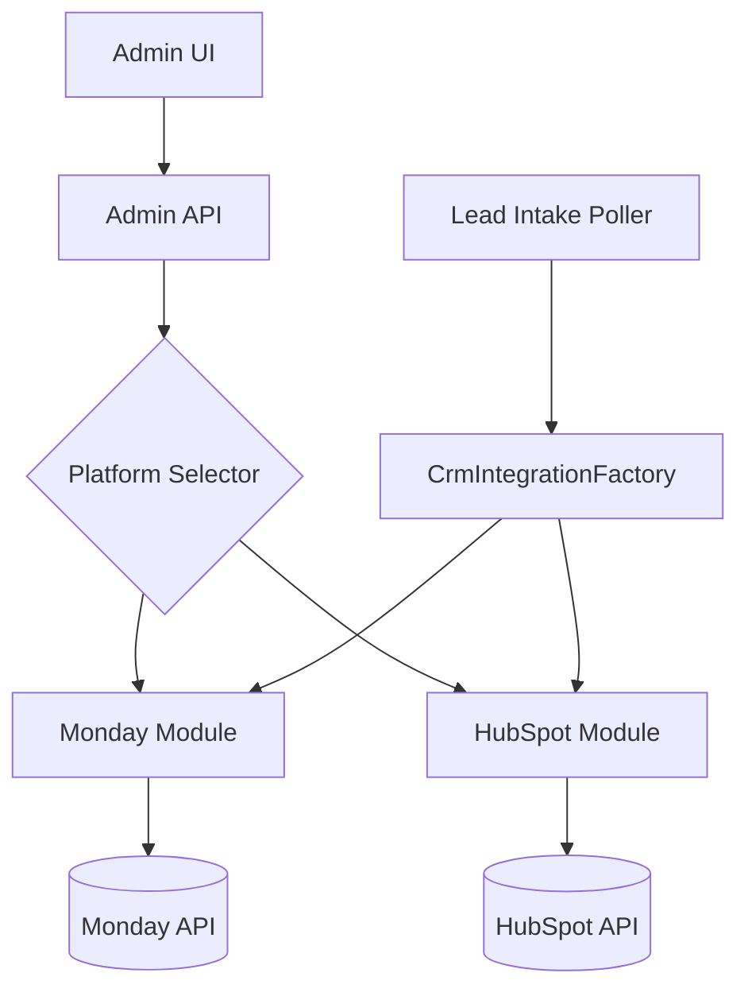

# HubSpot Integration Strategy - Lead Routing System

## Overview
This plan outlines the professional stages for adding HubSpot as a supported CRM/Lead source, building upon the existing Monday.com architectural patterns while introducing necessary abstractions for multi-platform support.

## Current State Analysis (Monday.com)
The current system is tightly coupled to Monday.com in several areas:
- **Admin API**: Routes like `/admin/monday/*` are specific to Monday's structure (Boards/Columns).
- **Ingestion**: `LeadIntakePoller` uses `createMondayClientForOrg` and expects Monday's column formats (e.g., `personsAndTeams`).
- **Mapping**: `FieldMappingConfig` uses `primaryBoardId` and references `MondayColumnId`.
- **Credentials**: Stored in a Monday-specific table (`MondayCredential`).

## Proposed Architecture (Multi-CRM Support)
To support HubSpot (and future CRMs like Salesforce), we will transition to a **Provider-Based Architecture**.

---

## Technical Stages

### Stage 1: Core Abstraction & Infrastructure Refactoring
*Estimated Effort: High*
> [!IMPORTANT]
> This stage is critical to ensure HubSpot doesn't become a "hack" on top of Monday logic.

1. **Generalize Credentials**:
   - Introduce `CrmCredential` table in Prisma to store credentials for any platform (Provider [Monday/HubSpot], Key, Metadata).
   - Migrate existing Monday credentials (backward compatibility maintained).
2. **CrmClient Interface**:
   - Define a generic interface `ICrmClient` with methods: `fetchLeads()`, `writebackAssignment()`, `listObjects()`, `listFields()`.
3. **Internal Schema Generalization**:
   - Ensure the `InternalSchema` remains the source of truth for the Lead Routing engine, agnostic of where the data came from.
4. **Existing Client Protection**:
   - Follow the [Monday Safety Plan](file:///c:/Users/oran8/Desktop/leadrouting/lead-routing-phase1-FULL-latest-rebuilt-FIX3-smokefix/lead-routing-skeleton-node-ts/HUBSPOT/monday_safety_plan.md) to ensure existing connections are not affected.

---

### Stage 2: HubSpot Integration Module
*Estimated Effort: Medium-High*
1. **New Package**: `packages/modules/hubspot-integration`.
2. **HubSpot implementation**:
   - Implement `HubspotClient` using HubSpot's Node.js SDK or Axios.
   - Support for **OAuth 2.0 flow** (HubSpot standard) and **Private App Access Tokens**.
3. **Data Translation**:
   - Converters to transform HubSpot "Properties" (e.g., `firstname`, `dealstage`) into our `InternalField` format.

---

### Stage 3: Intake & Webhooks Strategy
*Estimated Effort: Medium*
1. **HubSpot Poller**:
   - Create a poller specifically for HubSpot Deals/Contacts.
   - Logic to detect "New Lead" vs "Updated Lead" in HubSpot properties.
2. **HubSpot Webhooks**:
   - Implement `/webhooks/hubspot` endpoint.
   - Generalize the `LeadUpdateDetector` to handle HubSpot's payload structure.
3. **Parallel Polling Engine**:
   - Implement the `startCrmIntakeEngine()` to run HubSpot and Monday intake processes in parallel without interference.

---

### Stage 4: Admin & Mapping Wizard Evolution
*Estimated Effort: Medium*
### 1. Multi-Source Configuration & Wizard Reuse
- **Consistent UX**: The system will **reuse the existing multi-step Mapping Wizard** UI.
- **Provider-Aware Steps**:
  - **Step 1**: Load "HubSpot Objects" (Deals/Contacts) instead of Monday Boards.
  - **Step 2/3**: Load "HubSpot Properties" instead of Monday Columns.
  - **Step 4**: Load "Deal Stages" instead of Monday Statuses.
- **Toggle**: A simple CRM selector at the beginning of the Wizard to switch between Monday and HubSpot.
2. **Success Metrics for HubSpot**:
   - Define "Closed Won" logic for HubSpot (e.g., `dealstage = 'closedwon'`).

---

## Stage 5: Professional Standards & Observability
*Estimated Effort: Medium*

### 1. Observability & Monitoring
- **Distributed Tracing**: Assign a `traceId` to every lead intake (webhook or poll) that follows the lead through the scoring engine and into the routing proposal.
- **Provider Health Dashboard**: Implement a "Health Heartbeat" for HubSpot connection (checking token validity and API rate limit usage).
- **Audit Logging**: Detailed logging of every "Token Refresh" event and "API Request" failure with contextual error codes.

### 2. Resilience & Error Handling
- **Circuit Breaker**: Implement a circuit breaker pattern in the `HubspotClient`. If HubSpot returns 5xx errors multiple times, temporarily pause polling for that Org to prevent cascading failures.
- **Smart Retries**: Use exponential backoff for 429 (Rate Limit) errors, respecting the `Retry-After` header from HubSpot.

### 3. Advanced Security
- **Key Rotation**: Infrastructure to support rotating the `CLIENT_SECRET` without downtime.
- **Encryption at Rest**: Ensure all OAuth tokens are encrypted using `AES-256-GCM` with a unique Initialization Vector (IV) per record.

### 4. Developer Experience (DX)
- **HubSpot Sandbox Support**: Allow admins to connect a "Test Portal" before going live.
- **Webhook Debugger**: A small utility in the Admin UI to see the "Last 10 Webhook Payloads" received from HubSpot for troubleshooting.

---

## Stage 7: User Readiness & Prerequisites
To begin the implementation, the user/admin needs to prepare the following on the HubSpot side:

### 1. HubSpot Developer Account & App
- **Public App (Recommended for Multi-Org)**: Create a developer account at [developers.hubspot.com](https://developers.hubspot.com).
- **Credentials**: Obtain the `CLIENT_ID` and `CLIENT_SECRET`.
- **Redirect URI**: Configure the redirect URL in HubSpot (e.g., `https://your-api.com/auth/hubspot/callback`).

### 2. Required Scopes
Ensure the app has the following scopes enabled:
- `crm.objects.deals.read` / `crm.objects.deals.write`
- `crm.objects.contacts.read` / `crm.objects.contacts.write`
- `crm.objects.companies.read`
- `crm.objects.owners.read` (to fetch the list of agents)
- `crm.objects.tasks.write` (if using Task-based assignment)

### 3. Test Environment
- **Sandbox Portal**: It is highly recommended to create a "Standard Sandbox" in HubSpot for the initial development and smoke testing phases.

### 4. Data Decisions (Confirmed)
- **Primary Object**: **HubSpot Leads** (Sales Hub).
- **Routing Trigger**: **Immediate intake** upon lead creation.
- **Field Mapping (Parity with Monday.com)**:
  - `name` -> `itemName` (Lead Name)
  - `hs_analytics_source` -> `leadSource` (Source)
  - `owner_id` -> `assignedUserId` (Agent Assignment)
  - `hs_lead_status` -> `statusValue` (Status mapping for Won/Lost/Excluded)
  - `hs_last_contacted` -> `contactedStatusValue` (Response time tracking)
  - `notes_next_activity_date` -> `nextCallDate` (Next Steps)
  - `createdate` -> `enteredAt` (Timestamp)

### 5. Status Value Mapping (Step 4 Parity)
For HubSpot, we will map "Internal Stages" to system logic:
- **Excluded Stages**: Map HubSpot stages like `closedlost` (with reason 'spam') or custom stages to "Excluded".
- **Won Stages**: Map `closedwon` to "Deal Won".
- **Lost Stages**: Map `closedlost` to "Deal Lost".
- **In-Treatment**: Automatically detected when `hubspot_owner_id` exists and stage is not a closed stage.

- **Writeback Mapping**:
  - `hubspot_owner_id` <- Assigned Agent (Writes routing result back to HubSpot Owner)

---

## Stage 8: Execution Timeline (High-Level)
- **Week 1**: Stage 1 & 2 (Refactoring & Core Module).
- **Week 2**: Stage 3 & 4 (Intake & Admin UI).
- **Week 3**: Stage 5 & 6 (Observability & Testing).

---

## User Review Required
> [!IMPORTANT]
> **Primary Object Selection**: Following your feedback, the system will prioritize the **HubSpot Leads object** (Sales Hub) for initial routing.
> - **Flow**: Lead is created in HubSpot -> Webhook/Poller detects it -> System routes to Agent -> System updates `owner_id` on the Lead.
> - **Result**: The lead appears immediately in the correct rep's "My Leads" section in the Sales Workspace.

---

## Verification Plan
### Automated Tests
- `npm run test:hubspot` - New unit tests for the HubSpot client.
- `smoke-hubspot-ingestion.ps1` - PowerShell script to simulate a HubSpot webhook and verify lead creation in `LeadFact`.

### Manual Verification
- Testing the OAuth "Connect to HubSpot" button in the Admin UI.
- Verifying property mapping in the Field Mapping Wizard for HubSpot properties.
